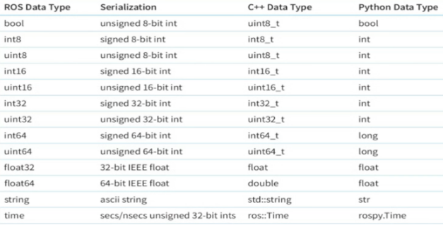

# Eteration Case

[README.pdf](resources/README.pdf)

---

# Özet

Bu depoda ROS1 üzerinde mesaj oluşturma, yayıncı ve abone düğüm oluşturma, topic yayınlama, launch ve test dosyası oluşturma ve unit test yapma konuları pratik olarak çalışılmış, faydalanılan kaynaklar başlıkların hemen altında belirtilmiştir.

Ubuntu 20.04 LTS işletim sistemi üzerinde ROS Noetic kullanılmıştır.

Hazırlayan: **Ahmet Talha Ardıç**

(Not: Doküman Notion ile hazırlanmış ve markdown çıktı alınmıştır. Güncellenebilirlik açısından Notion ve markdown tercih edilmiştir.

[https://ahmetardic.notion.site/Eteration-Case-00724dbbf392401dbc585d627d058ea9](README.md))

# Ön Hazırlık

### ROS Noetic Kurulumu (checkpoint II)

Ubuntu 20.04 LTS işletim sistemi kullanıldığı için aşağıdaki adımlar gerçekleştirilerek ROS Noetic kurulması gerekmektedir. 

Önerildiği gibi full paket kurulabilir.

[Wiki](http://wiki.ros.org/noetic/Installation/Ubuntu)

### GitHub Public Repository (checkpoint I - III)

[https://github.com/AhmetArdic/EterationCase.git](https://github.com/AhmetArdic/EterationCase.git)

**ROS gitignore** ile bir repository oluşturulur. 

workspace ve workspace/src dizinlerini oluşturduktan sonra `catkin_make` ile çalışma alanı yapılandırılır.

# Görevler

[Wiki](http://wiki.ros.org/ROS/Tutorials)

## Paket oluşturma (checkpoint V)

[Wiki](http://wiki.ros.org/ROS/Tutorials/CreatingPackage)

<aside>
⚠️ “**composiv_tryouts**” isimli paketi oluşturmadan önce terminalde **workspace/** içerisinde `source devel/setup.bash` komutu çalıştırılarak çevresel değişkenler tanıtılmalıdır.

</aside>

Bu paketi oluşturmak için ise **workspace/src/** dizini içerisinde `catkin_create_pkg <package_name> [depend1] [depend2] [depend3]` şeklinde kullanımı olan **catkin_create_pkg** komutu çağrılmalıdır. → `catkin_create_pkg composiv_tryouts std_msgs rospy`, pakette C++ bağımlılığı yok çünkü kullanılması planlanmamaktadır.

Her paket oluşturmadan sonra çalışma alanı yeniden yapılandırmalıdır bu sebeple **workspace/** altına gelip `catkin_make` yapılır. (Bu tür dizin değiştirmeleri için alias ataması yapılabilir, şimdilik ihtiyaç duyulmamıştır fakat bilinmesinin hız açısından önemlidir.)

---

**Bu aşamada paketi özelleştirmek için çalışma alanı VS Code ile açılabilir.**

### package.xml

[Wiki](https://wiki.ros.org/catkin/package.xml#Dependencies)

Paketimiz hakkındaki bilgileri, paketimizin bağımlılıklarını kısaca metadata’yı barındıran bir dosyadır.

Özelleştirme olarak paketin ismi, versiyonu, açıklaması, lisansı, sahibi, bakımcısı gibi bilgiler bulunur.

Paketleri 6 farklı bağımlılığa sahip olabilir:

- **Build Dependencies:** Paketi oluşturmak için hangi paketlerin gerekli olduğunu belirtir. Bu, derleme zamanında bu paketlerden herhangi bir dosyanın gerekli olduğu durumdur.
- **Build Export Dependencies**
- **Execution Dependencies:** Paketteki kodu çalıştırmak için hangi paketlerin gerekli olduğunu belirtir. Bu durum, bu paketteki paylaşılan kütüphanelere bağımlı olduğunuzda geçerlidir.[[https://answers.ros.org/question/283123/what-is-the-difference-between-exec_depend-and-run_depend/](https://answers.ros.org/question/283123/what-is-the-difference-between-exec_depend-and-run_depend/)]
- **Test Dependencies:** Birim testleri için yalnızca *ek* bağımlılıkları belirtir. Bunlar asla derleme veya çalıştırma bağımlılıkları olarak belirtilen bağımlılıkları tekrarlamamalıdır.
- **Build Tool Dependencies:** Paketin kendisini derlemek için ihtiyaç duyduğu derleme sistemi araçlarını belirtir. Tipik olarak derleme aracı catkin'dir.
- **Documentation Tool Dependencies:** Paketin dokümantasyon oluşturmak için ihtiyaç duyduğu dokümantasyon araçlarını belirtir.

---

Örneğin otomatik oluşturulan **package.xml** içerisinde yorum satırlarında açıkladığı gibi bir değişiklik yapabilir.

```xml
Use depend as a shortcut for packages that are both build and exec dependencies -->
  <!--   <depend>roscpp</depend> -->

<depend>rospy</depend>
<depend>std_msgs</depend>
<!------same------>
<build_depend>rospy</build_depend>
<build_depend>std_msgs</build_depend>
<build_export_depend>rospy</build_export_depend>
<build_export_depend>std_msgs</build_export_depend>
<exec_depend>rospy</exec_depend>
<exec_depend>std_msgs</exec_depend>
```

---

<aside>
⚠️ Bu dosyada yapılan değişikliğin işlemesi için `catkin_make` yapılmalıdır.

</aside>

## Yayıncı ve Abone düğüm oluşturma (checkpoint VI)

### msg oluşturma

[Wiki](http://wiki.ros.org/ROS/Tutorials/CreatingMsgAndSrv)

- Burada kullanılabilen veri tipleri gösterilmiştir.
    
    
    

Bu bilgiden faydalanılarak workspace/src/composiv_tryouts/msg/ dizini içerisinde **hit.msg** isminde bir dosya oluşturulmuştur.

Bu mesajın amacı bir FPS oyununda vuran kişinin ismini, vurulan kişinin ismini, verilen son hasarı ve vurulan kişinin canını sürekli olarak yayınlamaktır.

Bunun için ilgili veri tipleri ile **hit.msg** dosyası oluşturulmuştur ve paket içerisindeki *package.xml* ve *CMakeList.txt* dosyaları güncellenmiştir.

---

Yayınlanacak mesaj oluşturulduktan sonra ROS düğümlerinin yazılmasına geçilebilir.

[Wiki](http://wiki.ros.org/ROS/Tutorials/WritingPublisherSubscriber%28python%29)

workspace/src/composiv_tryouts/scripts/ dizininde **composiv_talker.py** ve **composiv_listener.py** dosyaları oluşturulur.

**talker** düğümünün amacı **hit.msg** mesaj dosyasına göre mesaj oluşturmak ve bunu `/hit_topic` konusu ile yayınlamaktır. Yayınladığı veriler aşağıdaki gibidir:

- shooter → string
- hitted → string
- last_damage → uint8
- hitted_healty → uint8

Burada yayınlanan mesaj tamamen farazidir. Örneğin bu düğüm, kameradan aldığı bir görüntüyü de yayınlayabilir.

**listener** düğümün amacı ise yayınlanan topic’e abone olup, içindeki verilerden yararlanarak bir şey yapmaktır. Örneğin burada `Ahmet -> 79 damage -> Alp (21 health)` şeklinde manipüle edilmiştir. Fakat bu düğümde bir kamera görüntüsüne abone olunup nesne tespiti de yapabilir. Yapılabilecekler hayal gücü ile sınırlı.

<aside>
⚠️ Bu dosyaların Linux sisteminde çalıştırılabilmesi için executable özelliğin her bir dosyaya verilmesi gerekir. → `chmod +x <file>`

</aside>

Daha sonra `catkin_make` ile çalışma ortamını yapılandırabilmek için CMakeLists.txt dosyasında değişiklik yapılır ve yapılandırma işlemi tamamlanır. 

> **talker.py** ve **listener.py** interpreter ile yorumlandığından bu dosyalarda yapılacak değişiklik için tekrar tekrar `catkin_make` yapmaya gerek yoktur.
> 

---


rqt graph’ında görüldüğü gibi composiv_talker **/hit_topic** isimli bir konu yayınlamış ve composiv_listener bu konuya abone olmuştur.

---

### Düğümlerin çalıştırılması

workspace/ içerisindeki terminalde sırasıyla aşağıdaki komutlar çalıştırılır:

```bash
source devel/setup.bash
roscore
rosrun composiv_tryouts composiv_talker.py
rosrun composiv_tryouts composiv_listener.py
```

---

Çıktılar ise aşağıdaki gibidir:


## Launch dosyası oluşturma (checkpoint VII)

Bu dosyayı oluşturmaktaki amacımız biraz önce oluşturduğumuz düğümleri çalıştırmanın kolay yolunu meydana getirmektir.

workspace/src/composiv_tryouts/launch/ klasörünün içine **composiv_tryouts.launch** dosyası oluşturulur ve içeriği aşağıdaki gibi düzenlenir. 

```xml
<launch>

    <node pkg = "composiv_tryouts" name = "composiv_talker" type = "composiv_talker.py" output = "screen"></node>
    <node pkg = "composiv_tryouts" name = "composiv_listener" type = "composiv_listener.py" output = "screen"></node>

</launch>
```

<aside>
⚠️ Bu dosyanın Linux sisteminde çalıştırılabilmesi için executable özelliğin her bir dosyaya verilmesi gerekir. → `chmod +x <file>`

</aside>

Bu dosyayı çalıştırmak için `roslaunch composiv_tryouts composiv_tryout.launch` komutu çalıştırılabilir.

---

### Launch dosyasının çalıştırılması

workspace/ içerisindeki terminalde sırasıyla aşağıdaki komutlar çalıştırılır:

```bash
source devel/setup.bash
roslaunch composiv_tryouts composiv_tryouts.launch
```

---

Çıktılar ise aşağıdaki gibidir:


## Unit Test oluşturma (checkpoint IV)

[https://github.com/steup/Ros-Test-Example](https://github.com/steup/Ros-Test-Example)

Unit test, talker’ın doğru çalışıp çalışmadığı üzerine kurgulanmıştır. Eğer **talker.py** düzgün şekilde publish yapabiliyorsa sonuç SUCCESS olmalıdır.

Bunu yapabilmek için test/ dizini içerisinde **talker.test.py** isimli bir dosya oluşturulmuş ve test case yazılmıştır.

Bu test dosyasını talker ile birlikte çalıştırabilmek için launch dosyasına benzer bir test dosyası oluşturulmuştur. Bu dosya `rostest composiv_tryouts talker.test` şeklinde çağrılır.

<aside>
⚠️ Bu dosyanın çalışabilmesi için gerekli package.xml ve CMakeLists.txt düzenlemelerinin yapılması gerekir.

</aside>

<aside>
⚠️ Bu dosyanın Linux sisteminde çalıştırılabilmesi için executable özelliğin her bir dosyaya verilmesi gerekir. → `chmod +x <file>`

</aside>

---

### Test dosyasının çalıştırılması

workspace/ içerisindeki terminalde sırasıyla aşağıdaki komutlar çalıştırılır:

```bash
source devel/setup.bash
rostest composiv_tryouts talker.test
```

---

Çıktılar ise aşağıdaki gibidir:


